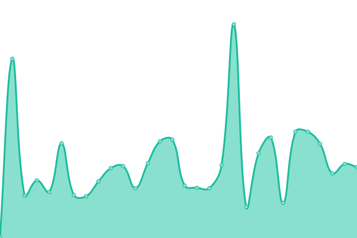
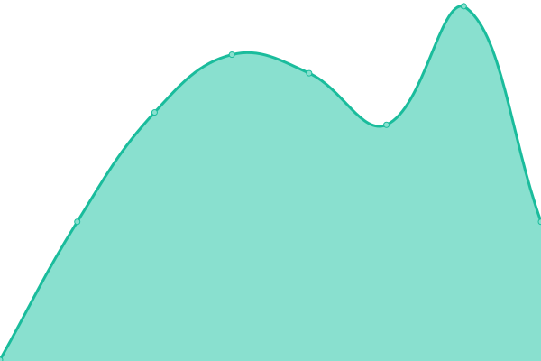

# [📈 Live Status](https://zarvhq.github.io/status-page): <!--live status--> **🟧 Partial outage**

This repository contains the open-source uptime monitor and status page for [Zarv](https://zarv.com), powered by [Upptime](https://github.com/upptime/upptime).

With [Upptime](https://upptime.js.org), you can get your own unlimited and free uptime monitor and status page, powered entirely by a GitHub repository. We use [Issues](https://github.com/zarvhq/status-page/issues) as incident reports, [Actions](https://github.com/zarvhq/status-page/actions) as uptime monitors, and [Pages](https://zarvhq.github.io/status-page) for the status page.

<!--start: status pages-->
<!-- This summary is generated by Upptime (https://github.com/upptime/upptime) -->
<!-- Do not edit this manually, your changes will be overwritten -->
<!-- prettier-ignore -->
| URL | Status | History | Response Time | Uptime |
| --- | ------ | ------- | ------------- | ------ |
|  [Zarv Website](https://www.zarv.com) | 🟩 Up | [zarv-website.yml](https://github.com/zarvhq/status-page/commits/HEAD/history/zarv-website.yml) | 

 339ms
     
 | 

<a href="https://zarvhq.github.io/status-page/history/zarv-website">100.00%</a>
    

|  [CDN](https://cdn.zarv.com) | 🟩 Up | [cdn.yml](https://github.com/zarvhq/status-page/commits/HEAD/history/cdn.yml) | 

 296ms
     
 | 

<a href="https://zarvhq.github.io/status-page/history/cdn">100.00%</a>
    

|  [Authentication](https://auth.zarv.com) | 🟥 Down | [authentication.yml](https://github.com/zarvhq/status-page/commits/HEAD/history/authentication.yml) | 

 119ms
     
 | 

<a href="https://zarvhq.github.io/status-page/history/authentication">4.96%</a>
    

<!--end: status pages-->

[**Visit our status website →**](https://zarvhq.github.io/status-page)

## 📄 License

- Powered by: [Upptime](https://github.com/upptime/upptime)
- Code: [MIT](./LICENSE) © [Zarv](https://zarv.com)
- Data in the `./history` directory: [Open Database License](https://opendatacommons.org/licenses/odbl/1-0/)
