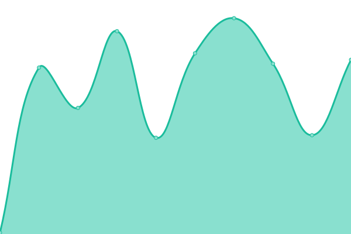

# [📈 Live Status](https://status.zarv.com): <!--live status--> **🟧 Partial outage**

This repository contains the uptime monitor and status page for [Zarv Platform](https://zarv.com).

<!--start: status pages-->
<!-- This summary is generated by Upptime (https://github.com/upptime/upptime) -->
<!-- Do not edit this manually, your changes will be overwritten -->
<!-- prettier-ignore -->
| URL | Status | History | Response Time | Uptime |
| --- | ------ | ------- | ------------- | ------ |
|  [Zarv Website](https://www.zarv.com) | 🟩 Up | [zarv-website.yml](https://github.com/zarvhq/status-page/commits/HEAD/history/zarv-website.yml) | 

 141ms
     
 | 

<a href="https://status.zarv.com/history/zarv-website">100.00%</a>
    

|  [CDN](https://cdn.zarv.com) | 🟩 Up | [cdn.yml](https://github.com/zarvhq/status-page/commits/HEAD/history/cdn.yml) | 

 300ms
     
 | 

<a href="https://status.zarv.com/history/cdn">100.00%</a>
    

|  Auth | 🟥 Down | [auth.yml](https://github.com/zarvhq/status-page/commits/HEAD/history/auth.yml) | 

 0ms
     
 | 

<a href="https://status.zarv.com/history/auth">0.00%</a>
    

|  Events Service | 🟩 Up | [events-service.yml](https://github.com/zarvhq/status-page/commits/HEAD/history/events-service.yml) | 

 354ms
     
 | 

<a href="https://status.zarv.com/history/events-service">100.00%</a>
    

|  CRM Service | 🟩 Up | [crm-service.yml](https://github.com/zarvhq/status-page/commits/HEAD/history/crm-service.yml) | 

 340ms
     
 | 

<a href="https://status.zarv.com/history/crm-service">100.00%</a>
    

|  Voice Service | 🟩 Up | [voice-service.yml](https://github.com/zarvhq/status-page/commits/HEAD/history/voice-service.yml) | 

 281ms
     
 | 

<a href="https://status.zarv.com/history/voice-service">81.81%</a>
    

|  Whatsapp Service | 🟩 Up | [whatsapp-service.yml](https://github.com/zarvhq/status-page/commits/HEAD/history/whatsapp-service.yml) | 

 121ms
     
 | 

<a href="https://status.zarv.com/history/whatsapp-service">100.00%</a>
    

|  Email Service | 🟩 Up | [email-service.yml](https://github.com/zarvhq/status-page/commits/HEAD/history/email-service.yml) | 

 87ms
     
 | 

<a href="https://status.zarv.com/history/email-service">100.00%</a>
    

<!--end: status pages-->

[**Visit our status website →**](https://status.zarv.com)

[**Active issues**](https://github.com/zarvhq/status-page/issues)

## ⚙️ Services Status

## 📄 About

- Powered by: [Upptime](https://github.com/upptime/upptime)
- Data in the `./history` directory: [Open Database License](https://opendatacommons.org/licenses/odbl/1-0/)
